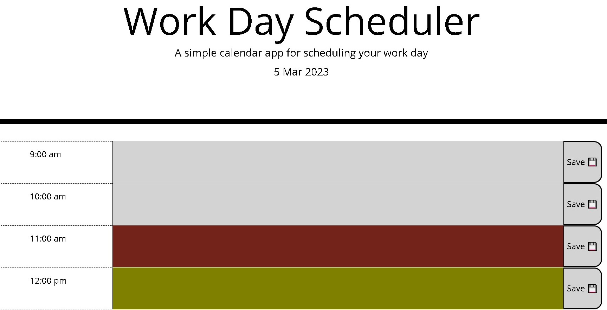

# Module 7 Challenge Daily Planner

This calendar application allows a user to save events for each hour of the day using jQuery.
  
## Installation

You can install this app by cloning the GitHub repository to your local computer. Copy the HTTPS link found under the “code” tab. Open Git Bash and run the command “git clone” then pasting the GitHub link. Run the command “code .” to open the files in VS Code. 

## Usage

To use code, you can review the javascript file above. To view the result of the code, you need to view them directly on the live web page by opening the Chrome DevTools by pressing Command+Option+I (macOS) or Control+Shift+I (Windows). A console panel should open either below or to the side of the webpage in the browser. There you will see the result of the code.

You can find the link to the deployed live webpage here: 
https://tala-ammoun.github.io/Daily-Planner/

### Final Result:

## Credits

N/A 

## License

Licensed under the MIT license.

---
© 2022 edX Boot Camps LLC. Confidential and Proprietary. All Rights Reserved.
